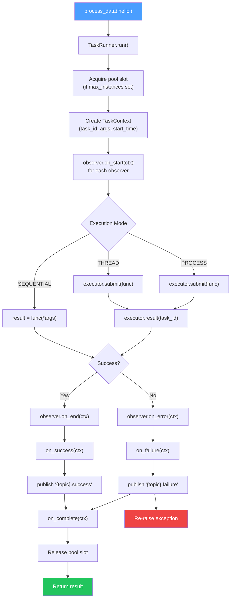
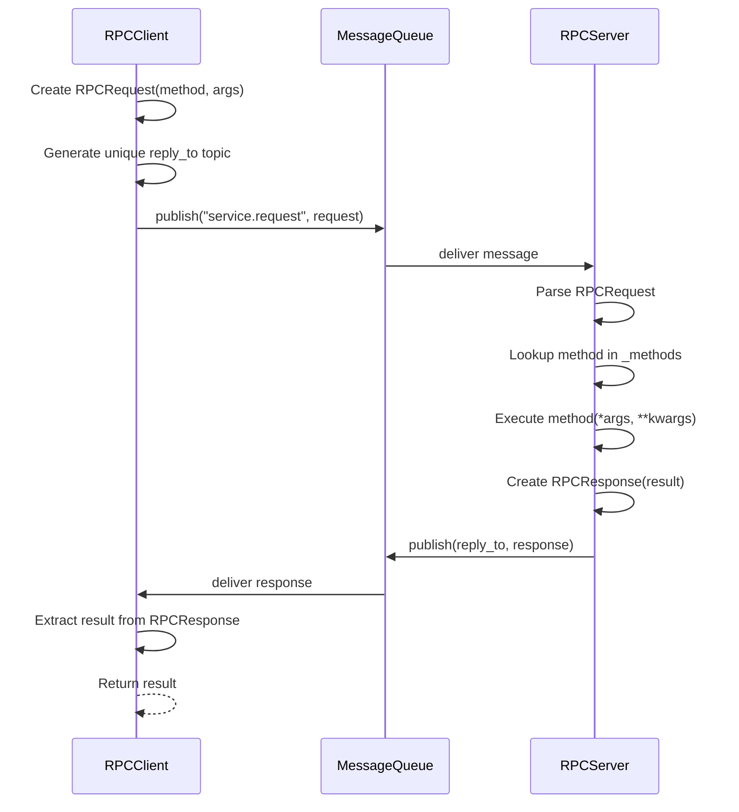
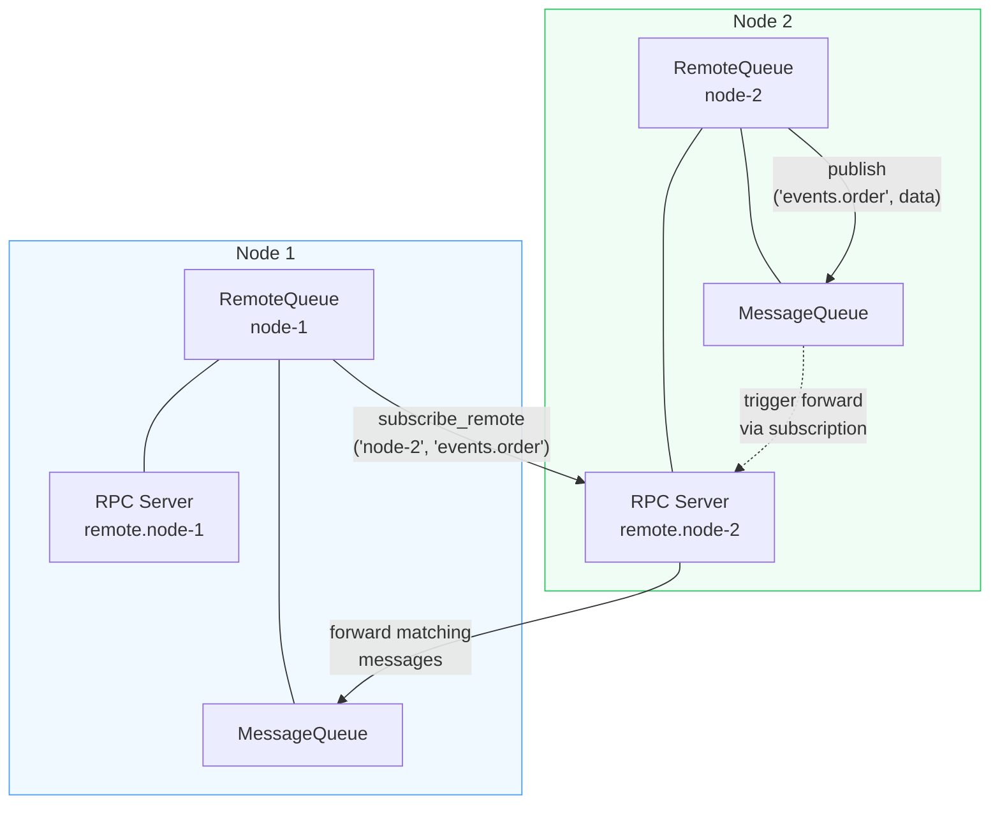

# CallPyBack Documentation

Message-driven task execution with pub-sub, executors, and RPC.

## Overview

CallPyBack is a Python library for building message-driven applications with:

- **Task Decorator**: Unified task abstraction with lifecycle support
- **Message Queue**: Pub-sub messaging with Pydantic validation
- **Executor**: Run tasks in sequential, thread, or process mode
- **RPC**: Remote procedure calls over message queue
- **Remote Queue**: Bridge queues across distributed nodes
- **Observers**: Profile and monitor task execution

## Installation

```bash
pip install callpyback

# Optional transports
pip install callpyback[redis]
pip install callpyback[zmq]
```

## Quick Start

```python
from callpyback import task, MessageQueue, Executor, ExecutionMode, TimingObserver

queue = MessageQueue()
timing = TimingObserver()

# Task with full lifecycle support
@task(
    queue=queue,
    topic="process.data",
    on_execute=[timing],
    on_success=lambda ctx: print(f"Done: {ctx.result}"),
)
def process_data(data):
    return data.upper()

# Direct call - returns result
result = process_data("hello")  # "HELLO"

# Queue trigger - same execution path
queue.publish("process.data", "world")

# Check timing stats
print(timing.stats)  # {'count': 2, 'avg': 0.001, ...}

# Parallel execution
with Executor(mode=ExecutionMode.THREAD, max_workers=4) as executor:
    results = executor.map(lambda x: x ** 2, [1, 2, 3, 4, 5])
```

## Execution Flow Diagrams

### Task Execution Lifecycle



### Queue-Triggered Execution

```mermaid
flowchart LR
    A["queue.publish\n('process.data', payload)"] --> B["Create Message"]
    B --> C["transport.send(msg)"]
    C --> D["MemoryTransport"]
    D --> E["Find subscribers\nfor topic"]
    E --> F["callback(msg)"]
    F --> G["@queue.on handler\nextracts payload"]
    G --> H["process_data(payload)"]
    H --> I["TaskRunner.run()\n(same lifecycle)"]

    style A fill:#4a9eff,color:#fff
    style I fill:#22c55e,color:#fff
```



### Observer Notification Order


### RPC Request-Reply Flow



### Distributed RemoteQueue Bridging



## Modules

- [Task](task.md) - Unified task decorator with lifecycle support
- [Message Queue](queue.md) - Pub-sub messaging
- [Executor](executor.md) - Parallel task execution
- [RPC](rpc.md) - Remote procedure calls
- [Remote Queue](remote.md) - Distributed messaging
- [Observers](observers.md) - Execution profiling
- [Types](types.md) - Pydantic models

## Architecture

```
callpyback/
├── types.py          # Pydantic models (Message, TaskResult, TaskContext, etc.)
├── transports/       # Message transport backends
│   ├── base.py       # Transport protocol
│   └── memory.py     # In-memory transport
├── queue.py          # MessageQueue with pub-sub
├── executor.py       # Unified Executor
├── task.py           # @task decorator and TaskRunner
├── rpc.py            # RPCServer and RPCClient
├── remote.py         # RemoteQueue for distributed messaging
└── observers.py      # Execution observers and Meter
```

## License

MIT
