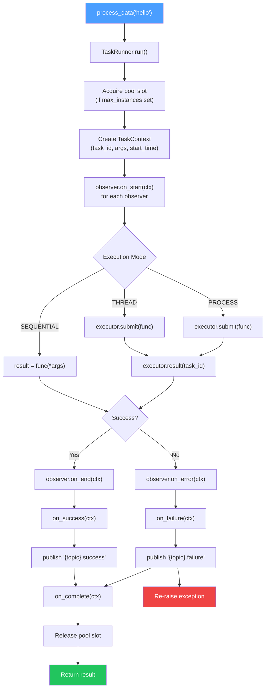
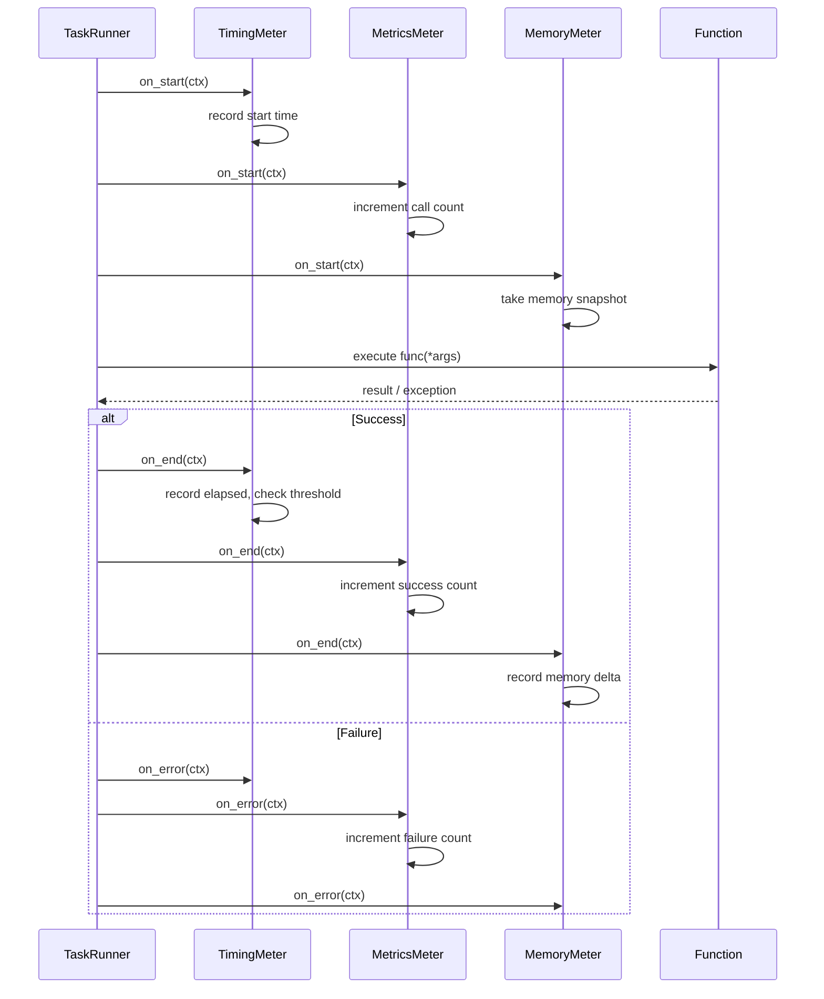
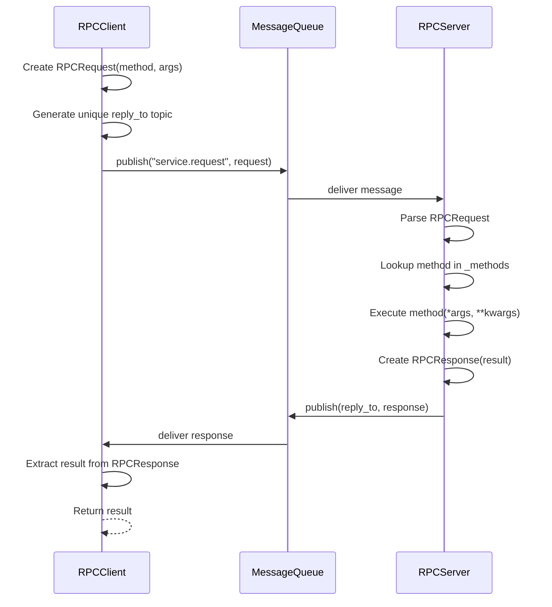
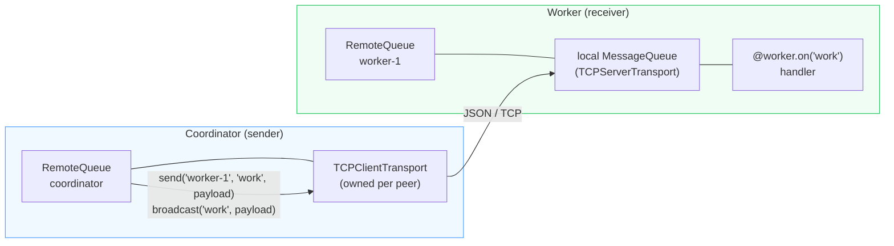

# eventforge Documentation

Message-driven task execution with pub-sub, executors, and RPC.

## Overview

eventforge is a Python library for building message-driven applications. The
mental model is a 2x2 of *what kind of exchange* (pub-sub fire-and-forget vs
request-reply) by *where the other side lives* (local vs remote):

|                  | local          | remote        |
|------------------|----------------|---------------|
| **pub-sub**      | `MessageQueue` | `RemoteQueue` |
| **request-reply**| `Executor`     | RPC (`RPCServer` / `RPCClient`) |

`Executor` runs work in-process; RPC runs it on another process or machine,
called by name. The `Transport` (Memory or TCP) is *where* local-vs-remote
lives. `@task` composes an `Executor` + a `MessageQueue` + `Observers`.

- **Message Queue**: local pub-sub messaging with Pydantic validation
- **Remote Queue**: push-only switchboard for cross-node pub-sub
- **Executor**: local request-reply -- run work in sequential, thread, or process mode
- **RPC**: remote request-reply over a message queue (`RPCClient.call(name, ...)` invokes a method registered on an `RPCServer`)
- **Task Decorator**: facade composing a runner + queue + observers
- **Observers**: profile and monitor task execution

## Installation

```bash
pip install eventforge
```

Core install pulls only `pydantic` + `typing-extensions`. The Memory and TCP
transports are stdlib. Optional extras: `eventforge[redis]` /
`eventforge[nats]` for the broker-backed transports, `eventforge[logfire]`
for Logfire emission.

## Quick Start

```python
from eventforge import task, MessageQueue, Executor, ExecutionMode, TimingMeter

queue = MessageQueue()
timing = TimingMeter()

# Task with full lifecycle support
@task(
    queue=queue,
    topic="process.data",
    on_execute=[timing],
    on_success=lambda ctx: print(f"Done: {ctx.result}"),
)
def process_data(data):
    return data.upper()

# Direct call - returns result
result = process_data("hello")  # "HELLO"

# Queue trigger - same execution path
queue.publish("process.data", "world")

# Check timing stats
print(timing.stats)  # {'count': 2, 'avg': 0.001, ...}

# Parallel execution
with Executor(mode=ExecutionMode.THREAD, max_workers=4) as executor:
    results = executor.map(lambda x: x ** 2, [1, 2, 3, 4, 5])
```

## Execution Flow Diagrams

### Task Execution Lifecycle



### Queue-Triggered Execution

```mermaid
flowchart LR
    A["queue.publish\n('process.data', payload)"] --> B["Create Message"]
    B --> C["transport.send(msg)"]
    C --> D["MemoryTransport"]
    D --> E["Find subscribers\nfor topic"]
    E --> F["callback(msg)"]
    F --> G["@queue.on handler\nextracts payload"]
    G --> H["process_data(payload)"]
    H --> I["TaskRunner.run()\n(same lifecycle)"]

    style A fill:#4a9eff,color:#fff
    style I fill:#22c55e,color:#fff
```



### Observer Notification Order



### RPC Request-Reply Flow



### RemoteQueue Push-Only Switchboard



A node owns one outbound TCP link per peer for `send` / `broadcast`, and
receives via an optional `local` MessageQueue that peers push into. It is
push-only: to pull a value from a peer, use RPC. See
[Remote Queue](remote.md).

## Modules

- [Task](task.md) - Unified task decorator with lifecycle support
- [Message Queue](queue.md) - Pub-sub messaging
- [Executor](executor.md) - Parallel task execution (local request-reply)
- [RPC](rpc.md) - Remote procedure calls
- [Remote Queue](remote.md) - Distributed messaging
- [Observers](observers.md) - Execution profiling
- [Types](types.md) - Pydantic models

## Architecture

```
eventforge/
  types.py          # Pydantic models (Message, TaskResult, TaskContext, etc.)
  transports/       # Message transport backends
    base.py         # Transport ABC
    memory.py       # In-memory transport (default)
    tcp.py          # JSON-over-TCP server/client transports
    redis.py        # Redis pub/sub transport (optional: [redis])
    nats.py         # NATS pub/sub transport (optional: [nats])
  queue.py          # MessageQueue with pub-sub
  remote.py         # RemoteQueue push-only switchboard
  executor.py       # Executor (local request-reply)
  rpc.py            # RPCServer and RPCClient (remote request-reply)
  task.py           # @task facade + TaskRunner
  observers.py      # Observable / Eventful / Dispatcher + Meters
  worker.py         # python -m eventforge.worker entrypoint
```

## License

MIT
